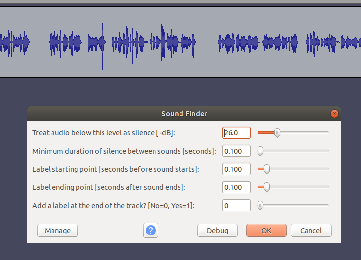
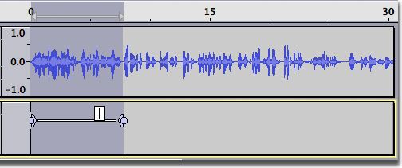
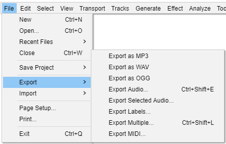
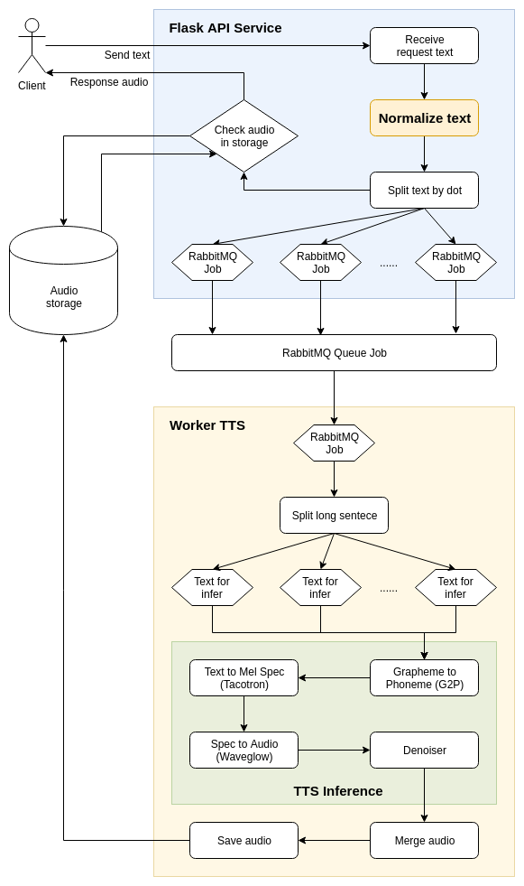

# Tài liệu cho hệ thống TTS
# I. Chuẩn bị dữ liệu
## I.1. Chọn giọng đọc
Đưa 2 đoạn văn bản cho các ứng viên đọc, sau đó chọn ra những giọng tốt nhất dựa trên các tiêu chí sau:

-   Giọng đọc hay thu hút
-   Tự nhiên: không cố nhấn nhá
-   Đọc rõ ràng: nghe rõ các từ dù đọc hơi nhanh nhưng không mất chút âm nào.
-   Độ ổn định: phong cách đọc, tốc độ đọc và âm lượng không thay đổi.

## I.2. Chuẩn bị transcript đọc
Lấy (crawl) các bài báo trên các trang báo mạng như Vnexpress hay dantri.com.vn đảm bảo:

-   Các lĩnh vực đa dạng: thể thao, sức khỏe, đời sống …    
-   Độ phủ từ ( trên 3k từ: cả từ vay mượn)

## I.3. Tổ chức ghi âm
-   Phòng thu: đảm bảo không để tiếng ồn lọt vào, tường có chống vọng và mic có filter.
-   Chiến lược ghi âm: Ban đầu ghi âm 30 phút/ ngày, kiểm duyệt liên tục theo ngày, cho đến khi toàn bộ dữ liệu ngày đó đảm bảo, thì cho họ ghi âm 1h-2h/ ngày.
-   Điểu kiện đảm bảo dữ liệu: độ ổn định giọng đọc, tự nhiên, không vấp, rõ ràng và đặc biệt không có nhiễu trong file audio.
-   Nghiệm thu dữ liệu hàng ngày: đảm bảo các ngày đọc không khác nhau, và dữ liệu vẫn đảm bảo các tiêu chí nêu trên. Dùng phần mềm Audacity để có thể phát hiện nhanh những đoạn âm thanh bất thường như nhiễu, tiếng ồn, tiếng còi xe, ...
- File ghi âm nên được ghi full sampling rate: 48k (hoặc 44k1) sampling rate, channel thường là 2, nhưng mình convert làm 1, định dạng WAV

## I.4. Tiền xử lý dữ liệu training  
- Sử dụng Audacity để tự động tách các khoảng **speech** và **silence**:
	- Chọn Audio cần cắt: File -> Import -> Audio
	- Chọn toàn bộ audio vừa import: Ctrl + A
	- Tự động tách vùng speech và silence: Analyze -> Sound Finder
	- Chọn tham số cắt: 26.0 - 0.100 - 0.100 - 0.100 - 0

	

	- Ấn OK để cắt
	- Lưu thông tin cắt: File -> Export -> Export Labels  

- Gộp các đoạn speech lại để được 1 câu audio theo quy tắc:
	- Chiều dài tối thiêu là 2s, tối đa từ 8-12s
	- Với đoạn speech < 2s, gộp với đoạn speech tiếp theo nếu silence < 1s
	- Với đoạn speech < 5s, gộp với đoạn speech tiếp theo nếu silence <= 0.5s
	- Với đoạn speech < 8s, gộp với đoạn speech tiếp theo nếu silence <= 0.2s
	- Với đoạn speech >=12s thì không gộp nữa

- Manual dùng audacity (khuyến nghị vì cho chất lượng tốt hơn).  
	- Cắt audio theo câu sử dụng tool Audacity  như trên
	- Tạo transcript cho mỗi câu tương ứng dùng label tool của audacity bằng cách click vào Edit > Labels > Add Label at Selection hoặc sử dụng tổ hợp phím Crtl+B như hình:

	

	- Chú ý: Có thể bấm phím B để nghe lại khi cần đồng thời nhìn vào transcript đưa phát thanh viên đọc để paste vào label.
	- Sau khi hoàn thiện cắt audio và add label tương ứng cho 1 audio dài, bạn có thể export lable đó ra bằng cách click vào menu: File >export > export labels. Dựa vào labels file, chúng ta có thể cắt audio tương ứng của labels bằng tool sox: E.g. ```sox input.wav output.wav trim 0 00:35```

	

- Desnoise bằng audacity theo cách như link sau: [https://www.podfeet.com/blog/recording/how-to-remove-noise-with-audacity/](https://www.podfeet.com/blog/recording/how-to-remove-noise-with-audacity/)
# II. Tài liệu training

Phần **Training tutorial** sẽ trình bày chi tiết các bước để có thể huấn luyện được mô hình TTS một cách tối ưu nhất 

Môi trường và project training **Tacotron2** + **Waveglow** được đóng gói trong docker được nén tại **tts_tacotron_waveglow.tar.gz**

**Cài đặt docker image**
- Cài đặt docker version 19.03 trở lên
- Cài đặt nvidia docker toolkit theo hướng dẫn
(https://github.com/NVIDIA/nvidia-docker)
- Import docker images:
```
docker load < tts_tacotron_waveglow.tar.gz
```
- Tạo container:
```
docker run -dit \
	--restart always --net host --gpus all \
	-v /data/storage/storage-tacotron:/storage-tacotron \
	-v /data/storage/storage-waveglow:/storage-waveglow \
	--name tts_training tts:tacotron-waveglow
```
- Truy cập vào container:
```
docker exec -it tts_training bash
cd /
```

## II.1. Tacotron2

Cấu trúc project Taocotron2
```
ztacotron2
└───base
	└───data
	│   │   camhieu
	│   │   ...
	└───experiments
	│   │   camhieu
	│   │   ...
	└───dicts
	│   │   phone_oov
	│   │   ...
	└───test_set
	│   │   vlsp2018.txt
	│   │   ...
	│   data_utils.py
	│   decode_time_stamps.py    
	│   distributed.py	
	│   gen_tts.py 
	│   glow.py
	│   hparams.py
	│   layers.py
	│   logger.py
	│   model.py
	│   multiproc.py
	│   oov2phonemes.py
	│   paths.py
	│   prepare_files_list.py
	│   prepare_wavs.py
	│   tacotron2_pretrained.pt
	│   text_embedding.py
	│   train_tacotron_new.py
	│   tts_infer.py
	│   utils.py
	│   vad.py
```

### II.1.1. Môi trường training
Môi trường training đã được đóng gói và chuẩn bị sẵn dưới dạng conda enviroment
```
conda activate tacotron
```

### II.1.2. Chuẩn bị dữ liệu training
Clone folder **base** để tạo 1 project riêng cho giọng mới
```
ztacotron2
└───base
└───camhieu
```

Thư mục chứa dữ liệu training cho từng giọng được đặt trong thư mục **data**, có cấu trúc như sau:
```
ztacotron2
└───camhieu
	└───data
	    └───camhieu
	        │   metadata.txt
	        └───wavs_raw
	            │   numiennam-camhieu-001-000697-001659.wav
	            │   numiennam-camhieu-001-001755-002716.wav
	            │   ...
```
**wavs_raw** là thư mục chứa các đoạn audio đã được cắt nhỏ ra theo từng câu từ audio gốc, cần đảm bảo các tiêu chí sau:

- Có độ dài từ 2-10s
- Đầu và đuôi audio không được cắt lẹm vào từ
- Các audio có format WAV - PCM 16 bit, sample rate có thể là 16000Hz hoặc 22050Hz tùy vào mô hình huấn luyện

**metadata.txt** là file chứa text của từng đoạn audio ở trên, có format như sau:

```
numiennam-camhieu-001-000697-001659|cho rằng thửa đất nhà mình bị thu hồi , và đền bù không đúng quy định của pháp luật * ông phạm văn phượng ở phố cầu mây , thị trấn sa pa đã làm đơn khiếu nại nhiều nơi
numiennam-camhieu-001-001755-002716|báo tài nguyên và môi trường nhận được đơn kêu cứu khẩn cấp của ông phạm văn phượng * trú tại tổ bảy a , phố cầu mây , thị trấn sa pa , huyện sa pa lào cai
numiennam-camhieu-001-002730-003265|phản ánh về việc ủy ban nhân dân huyện sa pa cưỡng chế , thu hồi đất để mở đường trái quy định
numiennam-camhieu-001-003390-004323|chia sẻ với phóng viên báo tài nguyên và môi trường * ông phạm văn phượng cho biết * gia đình ông có bốn thửa đất đều thuộc tổ mười một bê thị trấn sa pa
numiennam-camhieu-001-004335-004692|do ông nhận chuyển nhượng mua lại của người dân trên địa bàn huyện
numiennam-camhieu-001-004788-005666|đến năm hai ngàn không trăm mười bốn . ủy ban nhân dân tỉnh lào cai có chủ trương thu hồi đất để nâng cấp cải tạo mở đường nguyễn chí thanh tại thị trấn sa pa
```
- Định dạng \<name\>|\<text\>, trong đó *name* là tên audio, *text* là nội dung của audio tương ứng
- Text là các chữ thuần việt viết thường
	- Các chữ số phải được viết dưới dạng chữ đúng theo cách đọc của PTV (VD: năm 2019 -> năm hai không mười chín)
	 - Các từ vay mượn hoặc viết tắt phải được viết đầy đủ theo cách đọc của PTV (VD: ronaldo -> rô nan đô, donald trump -> đô nan trăm)
- Có 4 loại dấu bao gồm ~, . * sẽ được đánh tùy theo cách ngắt nghỉ của PTV:
	- Đánh dấu **~** giữa 2 từ nếu khoảng silence giữa chúng khoảng **0.09 - 0.15s**
	- Đánh dấu **,** giữa 2 từ nếu khoảng silence giữa chúng khoảng **0.15 - 0.3s**
	- Đánh dấu **.** giữa 2 từ nếu khoảng silence giữa chúng khoảng **0.3 - 0.45s**
	- Đánh dấu **\*** giữa 2 từ nếu khoảng silence giữa chúng lớn hơn **0.45s**

Config file **hparams.py** bằng cách sửa các dòng config sau:
```
data='data/camhieu', # Đường dẫn đến folder data
version='v1-20191113', # Tên version training
...
sampling_rate=16000, # Sample rate của audio
```
	
### II.1.3. Tiền xử lý dữ liệu

Sau khi đã chuẩn bị đầy đủ dữ liệu và nhãn như trên, ta sẽ tiến hành các bước tiền xử lý dữ liệu
#### Chuẩn hóa audio
Config file **hparams.py**
```
################################
# Audio Preprocess Parameters  #
################################
norm_volume=True, # True nếu muốn chuẩn hóa âm lượng audio
volume_ratio=0.7,
denoise=True, # True nếu muốn giảm noise cho audio, 
              # nếu audio không có noise thì ko nên bật
noise_frame=6,
vad=False, # True nếu muốn sử dụng Voice Acitivity Detection
vad_aggressiveness=1,
trim_silence=True, # True nếu muốn loại bỏ các khoảng silence lớn
trim_top_db=40,

filter_audios=True,  # True nếu muốn loại bỏ các audio dài
longest_wav_in_seconds=12, # Ngưỡng audio loại bỏ
limit_total_dur_in_hours=None,
```
Chạy:
```
python prepare_wavs.py --num_workers 16
```
Audio sau khi được chuẩn hóa sẽ được lưu vào folder **wavs_train**
```
ztacotron2
└───camhieu
	└───data
	    └───camhieu
	        │   metadata.txt
	        └───wavs_raw
	        │   │   numiennam-camhieu-001-000697-001659.wav
	        │   │   ...
	        └───wavs_train
	            │   numiennam-camhieu-001-000697-001659.wav
	            │   ...
```
#### Tách dữ liệu training & validation
Chạy:
```
python prepare_files_list.py
```
File metadata được tách làm 2 tập train và val, lưu ở thư mục **files_lists**
```
ztacotron2
└───camhieu
	└───data
	    └───camhieu
	        │   metadata.txt
	        │   wavs_raw
	        │   wavs_train
	        └───files_lists
	            │   metadata_train.txt
	            │   metadata_val.txt
```
### II.1.4. Config feature
Sửa config file **[hparams.py](http://hparams.py/)**:
```
################################
# Audio Feature Parameters     #
################################
max_wav_value=32768.0,
sampling_rate=22050,
filter_length=1024,
hop_length=256,
win_length=1024,
n_mel_channels=80,
mel_fmin=55,
mel_fmax=7650.0,
```

| Gender | sampling_rate | hop_length | win_length | mel_fmin | mel_fmax |
|:------:|:-------------:|:----------:|:----------:|:--------:|:--------:|
|  Male  |     16000     |     200    |     800    |   55.0   |  7600.0  |
|  Male  |     22050     |     256    |    1024    |   55.0   |  7650.0  |
| Female |     16000     |     200    |     800    |   95.0   |  7600.0  |
| Female |     22050     |     256    |    1024    |   95.0   |  7600.0  |

### II.1.5. Training
Chạy training trên GPU 0:
```
python train_tacotron_new.py --cuda 0
```
Sau khi chạy, thư mục lưu model và tensorboard log sẽ được lưu trong **experiments**:
```
ztacotron2
└───camhieu
	└───experiments
	    └───camhieu
	        └───logs
	        │   └───v1-20191113
	        │       │   events.out.tfevents.1573640376.ubuntu1804
	        └───tacotron_models
	            └───v1-20191113
	                │   tacotron2_0k.pt
```
Với config mặc định, cứ mỗi 5000 iter thì model sẽ được lưu lại 1 lần: tacotron2_0k.pt, tacotron2_5k.pt, tacotron2_10k.pt, ....

Nếu muốn tiếp tục training từ checkpoint cuối cùng, chạy:
```
python train_tacotron_new.py 
	-p=warm_start=false,checkpoint_path=last 
	--cuda 0
```
Nếu muốn tiếp tục training từ checkpoint bất kỳ, chạy:
```
python train_tacotron_new.py 
	-p=warm_start=false,checkpoint_path=/path/to/some_checkpoint.pt 
	--cuda 0
```

### II.1.6. Kiểm tra log
Check log trên tensorboard:
```
tensorboard --logdir experiments/camhieu/logs
```

### II.1.7. Tạo file TTS từ model
Gen audio với model mới nhất:
```
python gen_tts.py 
	--tacotron2 last 
	--waveglow waveglow_models/waveglow_doanngocle_v2 
	--test test_set/vlsp2018.txt 
	--cuda 0
```
Gen audio với model bất kỳ:
```
python gen_tts.py 
	--tacotron2 /path/to/some_checkpoint.pt 
	--waveglow waveglow_models/waveglow_doanngocle_v2 
	--test test_set/vlsp2018.txt 
	--cuda 0
```
Audio sẽ được gen ra tại thư mục **tts_samples**:
```
ztacotron2
└───camhieu
	└───experiments
	    └───camhieu
	        │   logs
	        │   tacotron_models
	        └───tts_samples
	            └───tacotron2_v1-20191113_5k+waveglow_doanngocle_v2
```
### II.1.8. Nghiệm thu mô hình
Để đánh giá mô hình một cách trực quan nhất, hãy gen audio từ checkpoint mới nhất và nghe thử, xem audio đã tự nhiên hay chưa, có đọc đúng hay không.

Thông thường, ta sẽ nghiệm thu theo lộ trình checkpoint như sau:
- 5k iters:  giọng đọc gần giống giọng gốc, đọc nghe được các từ. Ngoài ra có thể vẫn còn đọc sai, audio có thể hơi rè hoặc nghe không được tự nhiên
- 20k iters: giọng đọc tự nhiên hơn iters, đọc đúng từ hơn, audio trong hơn
- 40k iters: giọng đọc tự nhiên, đọc đúng từ, audio không còn rè
- 40-70k iters: có thể tốt hơn, cần gen audio ra nghe để cảm nhận.
=> Có thể chọn model 40k iters làm final model hoặc cao hơn.  Tuy nhiên cần lưu ý, iters càng cao thì audio càng có thể bị overfit

## II.2. Waveglow

Cấu trúc project Waveglow
```
zwaveglow
└───base
	└───data
	│   │   camhieu
	│   │   ...
	└───experiments
	│   │   camhieu
	│   │   ...
	└───utils
	│   │   audio.py
	│   │   display.py
	│   │   file.py
	│   config.json
	│   distributed.py	
	│   gen_wavs.py 
	│   glow.py
	│   mel2samp.py
	│   paths.py
	│   plotting.py
	│   prepare_files_list.py
	│   stft.py
	│   train_waveglow.py
```

### II.2.1. Môi trường training
Môi trường training đã được đóng gói và chuẩn bị sẵn dưới dạng conda enviroment
```
conda activate waveglow
```

### II.2.2. Chuẩn bị dữ liệu training
Clone folder **base** để tạo 1 project riêng cho giọng mới
```
zwaveglow
└───base
└───camhieu
```

Thư mục chứa dữ liệu training cho từng giọng được đặt trong thư mục **data**, có cấu trúc như sau:
```
zwaveglow
└───camhieu
	└───data
	    └───camhieu
	        └───wavs
	            │   numiennam-camhieu-001-000697-001659.wav
	            │   numiennam-camhieu-001-001755-002716.wav
	            │   ...
```
**wavs** là thư mục chứa các đoạn audio đã được cắt nhỏ ra theo từng câu từ audio gốc, cần đảm bảo các tiêu chí sau:
- Có độ dài từ 2-10s
- Đầu và đuôi audio không được cắt lẹm vào từ
- Các audio có format WAV - PCM 16 bit, sample rate có thể là 16000Hz hoặc 22050Hz tùy vào mô hình huấn luyện
- Audio wavs có thể lấy từ dữ liệu training của tacotron 
- Tổng dữ liệu chỉ nên có thời lượng từ **4-5h**, không nên nhiều quá, và cũng không nên ít quá

Config file **config.json** bằng cách sửa các dòng config sau:
```
{
	"data": "data/camhieu, # Đường dẫn đến folder data
	"version": "v1-20191119", # Tên version training
	...
	"feature_config": {
		...
	    "sampling_rate": 22050, # Sample rate của audio
	    ...
	},
	...
}
```

### II.2.3. Tiền xử lý dữ liệu
Chạy:
```
python prepare_files_list.py
```
Đường dẫn dữ liệu sẽ được tách làm 2 tập train và test, lưu thành các file như sau:
```
ztacotron2
└───camhieu
	└───data
	    └───camhieu
	        └───wavs
	        │   all.txt
	        │   train.txt
	        │   test.txt
```

### II.2.4. Config feature
Sửa config file **config.json**:
```
"feature_config": {
    "segment_length": 16000,
    "sampling_rate": 22050,
    "filter_length": 1024,
    "hop_length": 256,
    "win_length": 1024,
    "n_mel_channels": 80,
    "mel_fmin": 55.0,
    "mel_fmax": 7650.0
},
```

| Gender | sampling_rate | hop_length | win_length | mel_fmin | mel_fmax |
|:------:|:-------------:|:----------:|:----------:|:--------:|:--------:|
|  Male  |     16000     |     200    |     800    |   55.0   |  7600.0  |
|  Male  |     22050     |     256    |    1024    |   55.0   |  7650.0  |
| Female |     16000     |     200    |     800    |   95.0   |  7600.0  |
| Female |     22050     |     256    |    1024    |   95.0   |  7600.0  |

### II.2.5. Training
Chạy training trên GPU 0:
```
python train_waveglow.py --cuda 0
```
Sau khi chạy, thư mục lưu model và tensorboard log sẽ được lưu trong **experiments**:
```
zwaveglow
└───camhieu
	└───experiments
	    └───camhieu
	        └───logs
	        │   └───v1-20191119
	        │       │   events.out.tfevents.1573640376.ubuntu1804
	        └───checkpoints
	            └───v1-20191113
	                │   waveglow_camhieu_v1-20191119_0k.pt
```
Với config mặc định, cứ mỗi 5000 iter thì model sẽ được lưu lại 1 lần: tacotron2_0k.pt, tacotron2_5k.pt, tacotron2_10k.pt, ....

Mặc định "checkpoint_path": "last" trong config, nên nếu muốn tiếp tục training từ checkpoint cuối cùng, chỉ cần chạy:
```
python train_waveglow.py --cuda 0
```
Nếu muốn tiếp tục training từ checkpoint bất kỳ, sửa **checkpoint_path** trong file **config.json** rồi chạy:
```
python train_waveglow.py --cuda 0
```
### II.2.6. Kiểm tra log
Check log trên tensorboard:
```
tensorboard --logdir experiments/camhieu/logs
```
### II.2.7. Tạo file TTS từ model
Gen audio với model mới nhất:
```
python gen_wavs.py --cuda 0
```
### II.2.8. Nghiệm thu mô hình
Để đánh giá mô hình một cách trực quan nhất, hãy gen audio từ checkpoint mới nhất và nghe thử, xem audio nghe có giống audio gốc hay không

Thông thường, ta sẽ nghiệm thu theo lộ trình checkpoint như sau:
- 200k iters:  audio nghe đã khá giống audio gốc
- 300k iters: audio nghe giống audio gốc
- 300k+ iters: có thể tốt hơn
=> Thông thường iters từ 300k trở lên có thể chọn làm final model, tuy nhiên cần theo dõi validation loss để tránh tình trạng overfit

# III. Service TTS
## Tổng quan kiến trúc hệ thống
	

**Service Text To Speech** bao gồm 3 service con (được đặt tại: /data/tts/workspace), bao gồm:
-  **text-norm-service-deploy** - Java serivce: có nhiệm vụ chuẩn hóa text đầu vào thành dạng chữ viết thuần túy để mô hình TTS có thể đọc được
- **tts-service-aic** - Python web service: Web api dùng để nhận request từ client, đẩy job sang các worker và chờ nhận kết quả audio trả về
- **end2end_api_v2** - Python worker: nhận các job từ rabbitMQ, thực hiện chuyển hóa từ text sang audio
- **ZaG2P** - Python library: thư viện để chuyển đổi bất kỳ từ gì sang dạng phiên âm phoneme sử dụng deep learning (VD: cooku -> cúc kiu). Dùng để hậu xử lý mọi trường hợp OOV mà text norm service không xử lý được

## III.1. Service chuẩn hóa text
### III.1.1. Đường dẫn
```
cd /data/tts/workspace/text-norm-service-deploy
```
### III.1.2. Thêm các phiên âm cho các từ OOV (tiếng nước ngoài, viết tắt, ...)
File từ điển chứa phiên âm các từ OOV được lưu tại:
```
resources/dictionaries/oov_19092019.txt
```
Format để thêm các từ mới là: ```<từ>\t<phiên âm>``` . Trong đó ```<từ>``` và ```<phiên âm>``` cách nhau bởi dấu tab, ```<phiên âm>``` là dạng chữ viết đầy đủ cách đọc của từ đó.
Ví dụ:
```
csgt-tt	cảnh sát giao thông trật tự
dolta   đôn ta
donald  đô nan
trump   trăm
```
Chỉ cần bổ sung thêm cách phiên các từ OOV vào từ điển ở trên, rồi chạy lại service:
```
# Tắt service
ps aux | grep "java -jar TextNormService.jar" | \
		awk '{print $2}' | xargs kill -9
# Chạy lại service
nohup java -jar TextNormService.jar > log &
```
### III.1.3. Chạy service
```
nohup java -jar TextNormService.jar > log &
```
Mặc định service sẽ chạy trên 0.0.0.0:7779 (có thể sửa config trong conf.properties)

## III.2. Service web api
### III.2.1. Đường dẫn
```
cd /data/tts/workspace/tts-service-aic
```
### III.2.2. Config
Config được lưu tại ```config.py```
#### API_VOICES
Là array lưu trữ thông tin định danh (```id``` và ```name```) của từng giọng
```
API_VOICES = [
    {
        "id": 3,
        "name": "Hoa Mai - Sài Gòn",
    },
    {
        "id": 4,
        "name": "Hồng Đào - Hà Nội",
    },
    {
        "id": 5,
        "name": "Nam An - Sài Gòn",
    },
    {
        "id": 6,
        "name": "Bắc Sơn - Hà Nội",
    },
]
```
#### Config cho từng giọng
Mỗi giọng đều có những config sau:
```
# Hoa Mai - Sài Gòn
API_VOICE_END2END_CAMHIEU = 3
END2END_CAMHIEU_QUEUE = 'end2end_camhieu_queue'
K_TIMEOUT_CAMHIEU = 0.12
K_ABNORMAL_CAMHIEU = 0.33
```
Trong đó: 
- API_VOICE_END2END_CAMHIEU: id của giọng tương ứng ở trên
- END2END_CAMHIEU_QUEUE: tên queue được sử dụng trong rabbitMQ để giao tiếp với worker
- K_TIMEOUT_CAMHIEU: hệ số timeout. Thời gian timeout cho mỗi request được tính như sau:
$$ T_{timeout} = K_{timeout} * num\_of\_words $$
Thông thường ```k_timeout = 0.24 / số worker``` (càng nhiều worker k_timeout càng giảm)
- K_ABNORMAL_CAMHIEU: hệ số để xác định audio lỗi. Thông thường giữa thời lượng audio và số từ có tỉ lệ rất ổn định. Trong những trường hợp audio bị lỗi do mô hình (rè, rên rỉ, ...) thì thời lượng audoi sẽ dài hơn bình thường. Khi thời lượng audio lớn hơn một ngưỡng nhất định, ta sẽ coi nó là bất thường. Ngưỡng đó được xác định như sau:
$$ Duration_{abnormal} (seconds) = K_{abnormal} * num\_of\_words $$
Thông thường ```k_abnormal = 0.33```

####  Cách đưa giọng mới lên service
Ví dụ ta sẽ đưa giọng Hương Sen lên service
1. Thêm vào ```API_VOICES``` trong file config
```
API_VOICES = [
    ...
    {
        "id": 7,
        "name": "Hương Sen - Huế",
    },
]
```
2. Thêm config cho giọng Hương Sen
```
API_VOICE_END2END_HUONGSEN = 3
END2END_HUONGSEN_QUEUE = 'end2end_huongsen_queue'
K_TIMEOUT_HUONGSEN = 0.12
K_ABNORMAL_HUONGSEN = 0.33
```
3. Khởi tạo object cho giọng trong file **tts_main_service_aic.py**
```
voiceEnd2End_huongsen = VoiceEnd2End("end2end_huongsen",
	 queue=config.END2END_HUONGSEN_QUEUE, 
	 k_timeout=config.K_TIMEOUT_HUONGSEN, 
	 k_abnormal=config.K_ABNORMAL_HUONGSEN)
```
4. Thêm phần xử lý trong hàm **api_v1_path()** - file **tts_main_service_aic.py**
```
elif str(voiceId) == str(config.API_VOICE_END2END_HUONGSEN):
	return voiceEnd2End_huongsen.speak_rabbitMQ(NOT_SPECIFIED_DOMAIN, 
								        text, caching=False, normOOV=True)
```
5. Khởi động lại service
```
ps aux | grep "python3 tts_main_service_aic.py" | \
				awk '{print $2}' | xargs kill -9
nohup python3 tts_main_service_aic.py > log &
```
### III.2.3. Chạy service
```
nohup python3 tts_main_service_aic.py > log &
```

## III.3. Worker TTS
### III.3.1. Đường dẫn
```
cd /data/tts/workspace/end2end_api_v2
```
### III.3.2. Config
Config được lưu tại ```config.py```

**WAVEGLOW_PATHS**: đường dẫn waveglow model cho từng giọng
**TACOTRON_PATHS**: đường dẫn tacotron model cho từng giọng
**QUEUES**: rabbitMQ queue job tương ứng với từng giọng
**MAX_WORDS**: số từ tối đa mà mỗi giọng có thể đọc được
####  Cách đưa giọng mới lên service
Giả sử ta đưa giọng halinh lên service
1. Giọng halinh sẽ được định danh bằng tên "end2end_halinh"
2. Thêm đường dẫn waveglow model
```
WAVEGLOW_PATHS = {
	...
	"end2end_halinh": "trained/zwaveglow/waveglow_luongthuhien-22k_v1_425k_light.pt",
}
```
3. Thêm đường dẫn tacotron model
```
TACOTRON_PATHS = {
	...
	"end2end_halinh": "trained/halinh/tacotron2_halinh-22k_v2-20191123_20k.pt",
}
```
4. Thêm tên queue (trùng với tên RabbitMQ queue tương ứng ở API Service)
```
QUEUES = {
	...
	"end2end_halinh": "end2end_halinh_queue",
}
```
5. Đặt số từ tối đa giọng có thể đọc được
```
MAX_WORDS = {
	...
	"end2end_halinh": 30,
}
```
6. Thêm vào argument ```--voice``` trong file ```worker_rabbitMQ.py```
```
parser.add_argument('--voice', choices=[
        ...
        'end2end_halinh',
    ], required=True)
```
### III.3.3. Chạy service
```
nohup python3 worker_rabbitMQ.py \
	--voice end2end_halinh \
	--cuda 0 --new True > trained/halinh/1.log &
```
